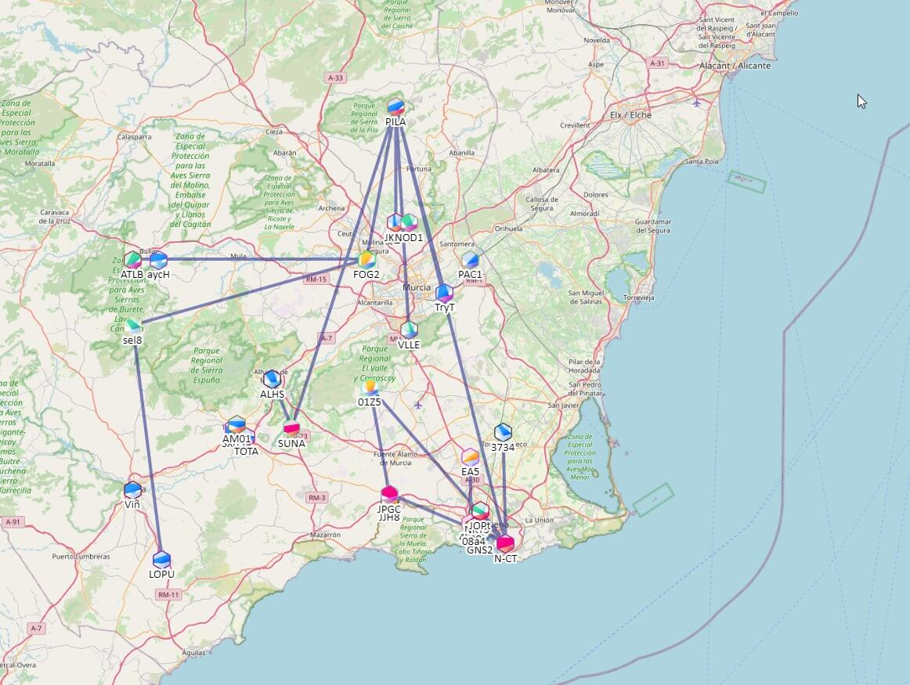

# 📡 Murcia y Cartagena se pasan de LongFast a MediumSlow

Tras la experiencia en Madrid, la comunidad Meshtastic de la Región de Murcia —especialmente en el área de **Cartagena**— ha decidido dar un paso similar: migrar la red del preset **LongFast** a **MediumSlow**. El objetivo es claro: reducir la saturación del canal y mejorar la estabilidad de la malla.

---

## 🚦 El punto de partida

En la región se habían detectado problemas de saturación como los siguientes:  
- Alta utilización del canal.  
- Nodos enviando trazas con demasiada frecuencia.  
- Sensación de que la red iba “a tirones”.  

La configuración LongFast, aunque ofrecía cierta rapidez, no estaba funcionando de manera óptima para una red con tantos nodos activos.

---


## ¿Qué significa MediumSlow?

Los presets de Meshtastic controlan la forma en que las radios **LoRa** transmiten los datos:

- **LongFast** → menos velocidad, mas alcance, más uso del canal.  
- **MediumSlow** → mas velocidad, menos alcance, menor uso del canal.  

El ajuste **MediumSlow** es un **equilibrio** entre alcance, estabilidad y consumo de ancho de banda.  
Al transmitir más rápido, cada paquete ocupa **menos tiempo efectivo de canal**, lo que se traduce en:

- Menos **colisiones** entre nodos.  
- Más **capacidad** para que varios usuarios compartan la misma frecuencia.  
- Una red **más estable y eficiente**.  

---

## ¿Va más lento?

Aquí hay una confusión frecuente.  
Cuando se usa **MediumSlow**:

- Los mensajes no “tardan más” en llegar al destino.  
- Simplemente, se transmiten de forma más eficiente, ocupando menos el canal y dejando espacio libre para otros.  

Dicho de otro modo:

- En **LongFast** → el canal se satura más rápido.  
- En **MediumSlow** → el canal queda más libre, ya que el bitrate es más alto aunque se sacrifica alcance.  

📌 **Resultado práctico**: la red soporta **más nodos y más tráfico** sin saturarse.  

---

## Ejemplo de la mejora

En pruebas reales con varios nodos:

- Al pasar de **LongFast** a **MediumSlow**, la **utilización del canal bajó drásticamente**.  
- Esto permitió que los mensajes se retransmitieran con menos pérdidas y sin congestión.  

<div style={{ display: "flex", flexWrap: "wrap", justifyContent: "center", gap: "1rem" }}>
  <figure style={{ margin: 0 }}>
    
    <figcaption style={{ textAlign: "center", marginTop: "0.5rem", fontSize: "0.9rem" }}>
      Utilización del canal antes de aplicar MediumSlow
    </figcaption>
  </figure>

  <figure style={{ margin: 0 }}>
    
    <figcaption style={{ textAlign: "center", marginTop: "0.5rem", fontSize: "0.9rem" }}>
      Utilización del canal después de aplicar MediumSlow
    </figcaption>
  </figure>
</div>


📊 En la captura se obserba cómo el uso de canal caía casi a la mitad tras el cambio.  

---

## Cómo cambiar a MediumSlow

Puedes cambiar este ajuste fácilmente con el comando CLI:

```bash
meshtastic --set lora.modem_preset MediumSlow --set lora.region EU868
```

O desde la app de Meshtastic, en el apartado: Radio → Modem Preset

:::warning 
Es importante asegurarse de que todos los nodos de la red usan la misma configuración para evitar incompatibilidades.
:::

:::danger Aviso importante
Para evitar pérdida de comunicación entre nodos, asegúrate de cambiar el canal del chat de `LongFast` a `MediumSlow`.  
Todos los dispositivos deben estar sincronizados con el mismo canal 0 para no perder comunicación.
:::


## Ventajas de usar MediumSlow

- ✅ Menor uso del canal
- ✅ Más eficiencia en la red
- ✅ Mejor funcionamiento en redes con muchos nodos


## Conclusión

Tras el cambio de preset de `LongFast` a `MediumSlow`, se ha observado una **reducción significativa del CH Util**, lo que implica un menor uso del canal y más eficiencia.

Aunque teóricamente esta reducción debería traducirse en una **pérdida de cobertura**, en la práctica **apenas se ha notado**. Las pruebas realizadas muestran que el alcance y la calidad de señal se mantienen estables, lo que confirma que MediumSlow es una opción viable incluso en entornos exigentes.

Actualmente la red de la zona Murcia / Cartagena contine estos nodos funcionando en MediumSlow:




Cambiar a **MediumSlow** es una de las mejoras más sencillas y efectivas en cualquier red Meshtastic saturada. En resumen: más estabilidad y más capacidad de comunicación compartida.
