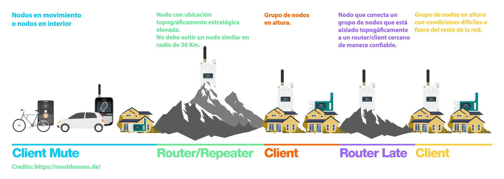

# Buenas prácticas

En este artículo te damos algunos consejos para que entre todos mantengamos la red funcionando a pleno rendimiento. Como es una tecnología descentralizada, es responsabilidad de todos hacer bien las cosas.

La idea es reducir el tráfico innecesario entre todos. Cada granito de arena cuenta, somos muchos y podemos hacer una gran diferencia en la calidad de la malla.

Es un artículo un poco largo, detallado y con explicaciones de los motivos de cada recomendación.

Aquí tienes una guía rápida, resumen de todo para ajustar y listo.

### Guia rápida

**[Nodeinfo](#nodeinfo) - Intervalo de transmisión de información del dispositivo:**
- Intervalo: **72h**

**[Posición](#posición) - Intervalos de transmisión automáticos:**

- Intervalo para nodos fijos: **72h**
- Intervalo para nodos móviles: **1h o más**
- Marcas/banderas de posicion: **Todas desactivadas**

**[Telemetría](#telemetría) - Intervalos de transmisión automáticos:**
- En nodo solar: **4h o más**
- En nodo troncal: **6h o más**
- En el resto: **Desactivada**

:::info
Los enlaces de los títulos te llevarán a una explicación más detallada.
:::

## ¿Por qué? Aspectos clave:

- Un nodo **NO** puede enviar y recibir mensajes a la vez. Si está oyendo, no está hablando, y viceversa.
- Un nodo sólo puede recibir **UN** mensaje a la vez. Si varios hablan a la vez, no te enteras de nada.
- Si un nodo detecta a otro nodo emitiendo, este **NO** emitirá mensajes (para evitar pisarse). Esperará a que la red esté libre.

Como ves, la malla necesita que los nodos se turnen para funcionar correctamente. Cuantos más nodos hay y más hablan entre ellos, más largas son las esperas de turno para todos.

El objetivo es reducir todo el tráfico innecesario, para hacer hueco a los mensajes de los usuarios.

En el momento de escribir este artículo, **la mensajería es menos de un 10% del tráfico total en España**. El resto es tráfico que no tiene utilidad real.

## Intervalos de broadcast automáticos

De fábrica, Meshtastic envía frecuentemente mucha información sobre tu nodo. Esto incluye su identificación, la posición, los niveles de batería...

En la mayoría de casos, no es necesario actualizar esta información porque no cambia o no es importante. **En las mallas grandes, es más del 90% del tráfico total.** 
:::note
Los intervalos propuestos son **MÍNIMOS**, puedes aumentarlos todavía más para mejorar el rendimiento en tu zona.
:::

### NodeInfo

Detalle de los datos identificativos del nodo: claves, ID... Se puede solicitar manualmente al nodo siempre que se quiera. Son datos que no suelen cambiar.

**Es la mayor parte del tráfico de la malla** (varias veces más que los mensajes de texto) y ocupan mucha capacidad de forma innecesaria.

Además, solo caben entre 80 y 200 en la memoria de los nodos. En una malla grande como la nuestra (+1500 nodos), se están borrando y reescribiendo constantemente porque no entran todos. Como es imposible conservarlos, automatizarlos **tiene poca utilidad**.

**El valor recomendado es 72h**:

- Android: `Configuración -> Configuración del dispositivo -> Dispositivo -> Intervalo de transmisión de información del dispositivo`
- iOS: `Configuración -> Dispositivo -> Node Info Broadcast Interval`

### Posición

En nodos fijos no cambia nunca por lo que no tiene sentido enviarla a menudo. Además, se puede solicitar manualmente al nodo siempre que se quiera.

**Para nodos fijos:** el valor recomendado es **72h**.

En nodos móviles o con GPS, puede interesar enviarla más frecuente pero sin abusar de ello porque provoca mucha congestión en la malla. Es recomendable deshabilitar el ajuste `Ubicación/Posición inteligente`.

**Para nodos móviles:** no es aconsejable bajar de 1h.

Se puede cambiar en:
- Android: `Configuración -> Configuración del dispositivo -> Posición -> Intervalo de transmision`
- iOS: `Configuración -> Posición -> Broadcast Interval`

También recomendamos **desactivar todos** los `Position flags` para reducir la cantidad de datos que emitimos.

- Android: `Configuración -> Configuración del dispositivo -> Posición -> Marcas de posición`
- iOS: `Configuración -> Posición -> Banderas de posición`

### Telemetría

Meshtastic permite enviar diversa información de los nodos. Datos de sensores de temperatura, presión, humedad... Tambien de su estado como la carga de la batería o el porcentaje de uso del canal RF.

Es información que generalmente no interesa a la malla 

- Android: `Configuración -> Configuración de módulo -> Telemetría`
- iOS: `Configuración -> Telemetría`

#### Telemetría del dispositivo:

- **Nodos enchufados a la corriente** en casa: **Desactivar**, tiene poca utilidad.
- **Nodos solares**: Es útil para ver el estado de la batería. Se puede poner en un intervalo de **4h o más**.
- **Nodos de infraestructura**: Si interconectan partes grandes de la malla, interesa poder ver el ChUtil (utilización del canal) que sirve para medir la saturación de la malla. **6h o más**

#### Medidas del entorno:
**Recomendamos desactivarlo** o poner un valor muy alto (superior a 4h).
La mayoría de nodos ni siquiera tienen estos sensores.

#### Medidas eléctricas:
**Recomendamos desactivarlo** a no ser que sepas exactamente si lo necesitas y para qué sirve

Solo algunos nodos reportan esta información avanzada de su consumo eléctrico. Si lo activas temporalmente para hacer pruebas, no te olvides de desactivarlo cuando termines.

## Utilizar el rol adecuado

Antes de decidir qué rol tendrá tu nodo, es importante que entiendas los mismos. Nada como la [documentación oficial](https://meshtastic.org/docs/configuration/radio/device/#roles) y esta [entrada del blog](https://meshtastic.org/blog/choosing-the-right-device-role/) para ello. En líneas generales, esta es nuestra recomendación:

**CLIENT_MUTE** para la mayoría de nodos. Permite enviar y recibir mensajes, sin reenviar los mensajes de otros (y sin saturar la malla). Ideal para nodos personales, en movimiento, que están en interiores, o que no tienen buena conexión con otros nodos.

**CLIENT** para nodos exteriores, con buena ubicación (tipo una azotea o una terraza despejada) que ayudan a una parte de la malla, reenviando los mensajes de otros. Tiene conexión directa con varios nodos.

**CLIENT_BASE** rol para nodos de tejados/azoteas. A partir de las ultimas versiones se comporta en parte como un ROUTER_LATE por lo que ya no se recomienda a no ser que sepas bien lo que haces. (MUY IMPORTANTE: en un nodo CLIENT_BASE solo se deben añadir como favoritos tus propios nodos interiores).

**ROUTER** para nodos ubicados en zonas muy estratégicas. Este rol requiere planificación y coordinación con otros miembros de la malla. No lo utilices si no tienes 100% claro lo que estás haciendo.

**ROUTER_LATE** funciona igual que el ROUTER pero con un retardo largo, no está recomendado utilizarlo puesto que causa problemas a la malla. También requiere planificación y coordinación con los demás igual que ROUTER.

:::tip
Esto es una red colaborativa y es más importante la calidad que la cantidad de nodos. No es necesario que todos repitamos mensajes. De verdad, no te sientas mal por tener únicamente nodos CLIENT_MUTE. 
Ya estás ayudando al no generar más tráfico. La red está bastante bien cubierta y probablemente puedas comunicarte con otros nodos sin problemas.
:::

:::note
Los roles no son definitivos, se pueden cambiar en cualquier momento. Quizás un día tu nodo CLIENT_MUTE se convierte en CLIENT porque te lo llevas a una azotea o empiezas a tener buenas conexiones.
:::

Ejemplos de roles incorrectos

- Asignar a un nodo CLIENT cuando no tiene buenas conexiones con otros nodos (debería ser CLIENT_MUTE). Lo único que consigues es entorpecer a los pocos nodos que te oigan.

- Un ROUTER en el tejado de casa (o en ubicaciones aún peores) que debería ser CLIENT.

## Cantidad de saltos máxima

Para evitar saturar la malla, es importante **no sobrepasar** el número de saltos máximo recomendado.
Este ajuste viene en **3 saltos** por defecto, que es más que suficiente según la [documentación oficial](https://meshtastic.org/docs/configuration/tips/#hop-count). Dejarlo en **3** es ideal.
:::note
Con 3 o 4 hops se llega bien a todas las partes de la malla.
:::

Si **realmente** necesitas subirlos, este ajuste se encuentra en `Configuración -> LoRa -> Número de saltos`

### Los saltos MÁXIMOS que recomendamos son:

- 4 - Para nodos bien conectados (CLIENT en exterior)
- 5 - **Solamente** si estamos en los extremos de la malla o para un nodo CLIENT_MUTE en interior.

:::info
Muchos usuarios creen erróneamente que poner 7 hops (el más alto) es mejor, pero es contraproducente para todos. Vienen configurados 3 de fábrica por algo.
:::
