# Guía de montaje del Karman’s Tube Solar

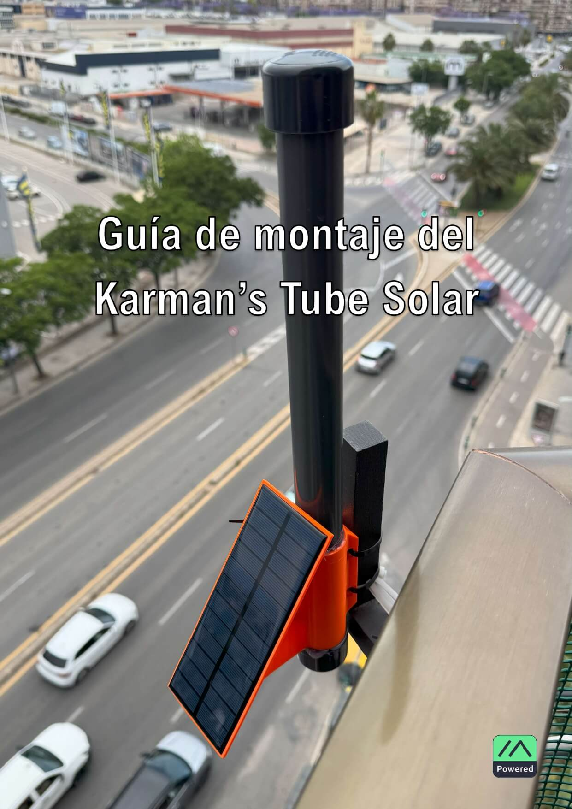

---

## Introducción

Esta guía te ayudará a montar un nodo solar autónomo de guerrilla con antena omnidireccional y sellado
climatológicamente con un coste total de unos **25€** (aproximadamente, a Junio de 2025) cada nodo.
Este nodo ha sido diseñado para ser lo más simple posible de modo que sea económico y sencillo de
ensamblar con la idea de instalarlo en ubicaciones altas para extender la red LoRa de Meshtastic. Por este
motivo carece de otras comodidades como pantalla, botones externos, GPS o avisadores.

### Contenido de la guía

- Descripción del montaje
- Piezas y lista de la compra
- Pedido de placas Faketec
- Primer arranque
- Montaje Faketec
- Diagrama de conexionado eléctrico
- Antena
- Montaje final
- Configuración básica
- Actualizaciones

### Materiales y herramientas requeridas

- Soldador y estaño
- Pinzas para SMD
- Silicona
- Taladro
- Sierra (tipo arco)
- Cinta kapton
- NanoVNA (opcional, para antena)

---

## Change Log

| Versión | Fecha      | Comentario                                     |
| ------: | ---------- | ---------------------------------------------- |
|    v0.1 | 11/06/2025 | Versión inicial                                |
|    v0.2 | 22/06/2025 | Añadida sección de actualización OTA Bluetooth |

---

## Diseño del nodo

El diseño de nodo se basa en el conocido y más que probado diseño **_Faketec v4_**. La Faketec es una plaquita
económica y sencilla de pedir (más abajo se indica como) que sirve para interconectar el módulo de radio con
el microcontrolador (MCU).
Por conveniencia la placa incorpora un divisor de tensión (dos resistencias) para
medir la batería y los botones de usuario y reset. Aquí no vamos a usar el botón de usuario, pero el reset es
conveniente para poner la MCU en modo de actualización (DFU) y cargarle el firmware de Meshtastic.

### Esquema simple:

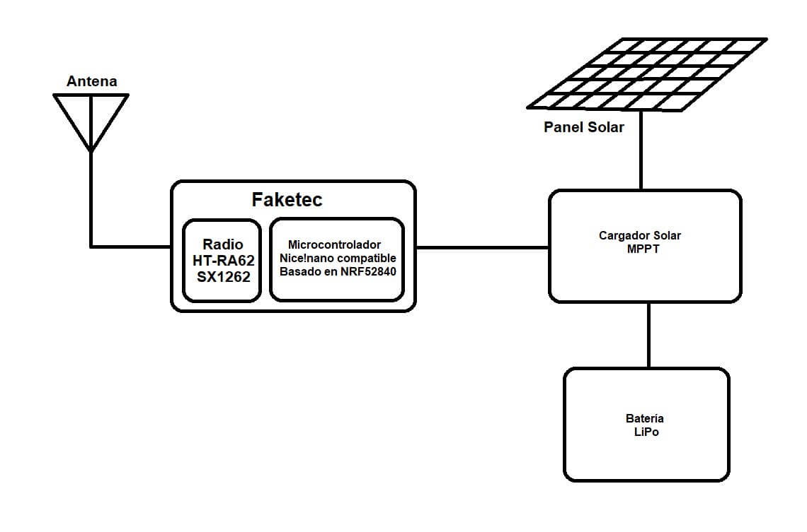

### Componentes

- **MCU**: Nice!Nano compatible (con Meshtastic)
- **Módulo de Radio**
- **Faketec**: interconecta radio y MCU
- **Cargador MPPT**
- **Batería LiPo**
- **Panel Solar**
- **Antena**

---

## ¿Por qué este diseño?

Además de los componentes descritos emplearemos un tubo de PVC para introducir y sellar los componentes
y emplearemos un soporte para la placa solar que se puede imprimir en impresora 3D que nos servirá tanto para
poner el panel solar en ángulo y aprovechar mejor el sol como para sujetar todo el montaje prácticamente a
cualquier superficie.

### Hay muchas versiones de Faketec, ¿Por qué la v4?

Para este nodo se van a emplear los FETs por lo que se puede usar una v1, una v2 o una v3, o la v4 sin soldar los
FETs. Yo he usado la v4 y las imágenes que se ven más abajo de montaje corresponden a la v4.
Tambien las hay más modernas, ¿Por qué no emplear una v5 o una v6?
Por simplicidad del diseño y adquisición de componentes, el BMS irá integrado en la batería, descartando la
necesidad del v5. Por otro lado se opta por un cargador solar MPPT externo fácil de cablear, descartando también
la Faketec v6.

### ¿Por qué no monitorizar la batería con un INA3221 o similares?

En mi opinión ver los amperios mediante un SHUNT no aporta información útil, hay que sumar el gasto
económico del sensor y el gasto energético del mismo. Con ver el ‘porcentaje’ de batería basándose en el divisor
de tensión incorporado en el Faketec v4 es suficiente para hacerse una idea del consumo y recarga de la batería.

### La batería parece pequeña. ¿Y si ponemos una más grande?

La MCU NRF52 consume poco. Realmente poco. 5mA en standby/recepción y unos 64mA en emisión. 1500mA
en caso de oscuridad total es más que suficiente para 5 a 8 días, en función de la carga de transmisión. Sin
embargo el MPPT hace milagros cargando en condiciones de luz pobres por lo que no espero que llegue a
apagarse el nodo.

### Hay cajas disponibles y también se pueden imprimir, ¿Por qué un tubo?

Es lo más barato de conseguir para sellar tanto la electrónica como la antena, todo junto, con solamente un par
de tapones y un agujero por donde entre el cable del panel solar. Si bien es cierto que no está expuesto el USB
y actualizarlo es un dolor en el culo, es poco probable que una actualización a estas alturas sea tan importante
que requiera actualizar forzosamente el nodo. En cualquier caso el método recomendado es preparar otro nodo
solar bien configurado y actualizado y reemplazar en el sitio el viejo por el actualizado.

---

## Lista de la compra

- [Microcontrolador](https://es.aliexpress.com/item/1005006446457448.html)
- [Módulo de Radio](https://es.aliexpress.com/item/1005008691299351.html)
- [Botones](https://es.aliexpress.com/item/1005004194174696.html)
- [Resistencias (680k y 1M)](https://es.aliexpress.com/item/1005002991902748.html)
- [Panel Solar](https://es.aliexpress.com/item/1005004580265551.html)
- [Cargador MPPT](https://es.aliexpress.com/item/4000235650965.html)
- [Baterías (x6)](https://es.aliexpress.com/item/1005007701459460.html)
- [Pigtails J-Pole](https://es.aliexpress.com/item/1005006962068226.html)
- [Soporte 3D](https://www.printables.com/model/1316317-meshtastic-solar-tube-node-diy-pvc-od325mm)
- Tubo PVC 32mm OD + 10 tapones (~7€, Leroy Merlin)
- PCB Faketec (30 unidades por 10€ en [JLCPCB](https://jlcpcb.com/es/))
- Cable de cobre rígido

:::info
Estos enlaces no son afiliados, no me pagan por ellos y
no gano nada por ponerlos. Los comparto por que mis nodos están todos construidos con los enlaces de arriba
y funcionando, de modo que es material probado.
:::

:::warning
Asegúrate de que compras el material correcto: Es normal entrar en aliexpress, buscar los componentes más
baratos y comprarlos ignorando los enlaces de arriba.
:::

:::warning
Asegúrate que funciona la MCU antes de soldar: Se que algunos módulos de imitación del nice!nano vienen
con un bootloader malo o sin bootloader y que hay que usar un ESP32 para reprogramarlos ANTES de soldarlos
a la Faketec. Al soldarlos a la Faketec se quedan escondidos los pads de programación del NRF52 y se hace muy
difícil, si no imposible, recuperar la plaquita. Personalmente no me ha pasado nunca tener que recuperar una
MCU de esta manera y por lo tanto no tengo experiencia.
:::

:::warning
Comprueba las medidas del tubo: El soporte 3D que he diseñado y que está enlazado arriba ha sido diseñado
para la placa solar que he comentado y para el diámetro exterior del tubo de 32,5mm, por lo que es
recomendable respetar esos componentes para no descuadrar la medidas.
:::

---

## Pedido de placas Faketec

1. Descargar los gerbers: [fakeTec_pcb_v4_GERBER.zip](https://github.com/user-attachments/files/18377935/fakeTec_pcb_v4_GERBER.zip)
2. Subir a [JLCPCB](https://jlcpcb.com/es/).

   
   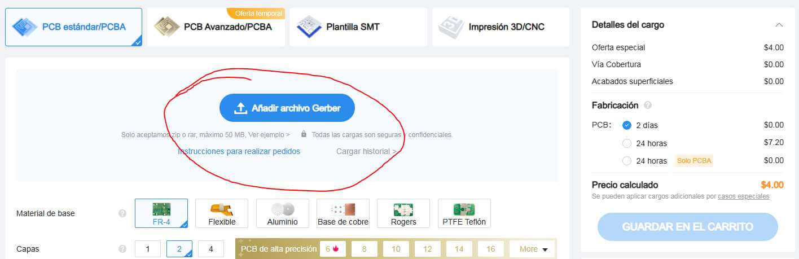

3. Seleccionar: 10 unidades, método IOSS

   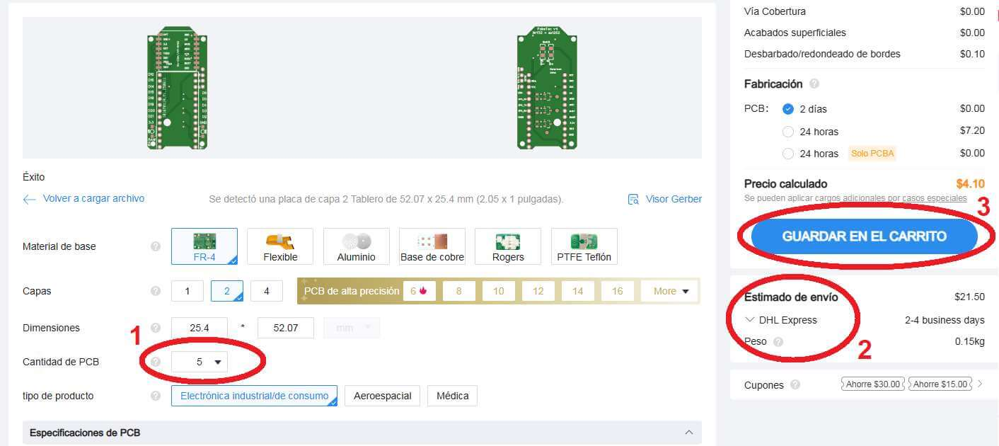

4. Revisa envío para evitar sorpresas en aduanas

   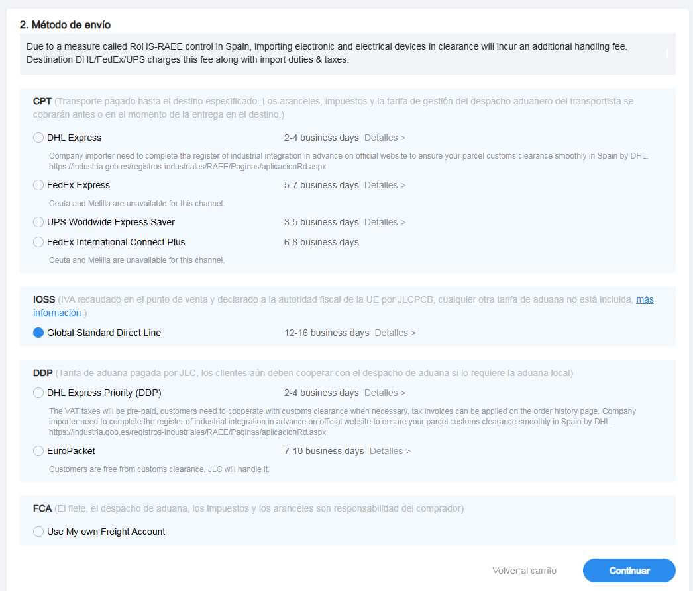

:::tip
Toda la información y versiones del proyecto _Faketec_ están en GitHub: https://github.com/gargomoma/fakeTec_pcb
:::

---

## Primer arranque

1. Conectar la MCU por USB
2. Cortocircuitar GND y Reset dos veces (modo DFU)
3. Verificar archivo `INFO_UF2.TXT`
4. Si necesario, borrar y actualizar bootloader:
   - [Borrar memoria](https://flasher.meshtastic.org/uf2/nrf_erase2.uf2)
   - [Bootloader v0.9.2](https://github.com/adafruit/Adafruit_nRF52_Bootloader/releases/download/0.9.2/update-nice_nano_bootloader-0.9.2_nosd.uf2)
5. Flashear Meshtastic: https://flasher.meshtastic.org/

---

## Montaje del Faketec

No voy a hacer un tutorial sobre como soldar en SMD porque entonces este manual no termina nunca. Pero sí
que vamos a pasar a comentar algunas indicaciones:

- Soldador de punta fina. Si es de temperatura regulable, mejor. A 300ºC le cuestan algunos contactos que
  son GND. En mi experiencia 330 o 340ºC es como mejor se trabajan estas placas.
- A mi me gusta usar estaño/plomo 60/40 con anima de resina/flux, y me gusta fino (0.6mm) para evitar
  hacer puentes.
- La MCU la he soldado directa sin pines. No pasa nada por poner pines, pero es el doble de soldaduras
  (soldar en MCU y luego en la faketec).
- Para soldar los SMD, primero se estaña únicamente uno de los pads, y se suelda sobre ese pad. Por
  ejemplo con las resistencias, se estaña un pad, se apoya el extremo de la resistencia sobre dicho pad
  mientras se le aplica calor con el soldador y cuando se licue el estaño se aprieta la resistencia contra el
  PCB.
- Por último se suelda el lado opuesto. Para soldar la radio lo mismo, se elige y se estaña un pad de
  cualquiera de las esquinas, se alinea manualmente la radio, se calienta el pad estañado y se aplica
  presión. Si no lo vemos bien alineado, podemos volver a calentar ese pad y mover la radio hasta que
  estemos contentos. Una vez contentos se sueldan el resto de contactos.
- No es necesario soldar las dos esquinas casi flotantes de la radio. Una es masa para antena y la otra
  masa general. Ambas están repetidas a lo largo del resto de pads.
- Las resistencias van una de 680k en R2 y una de 1M en R1 y configuro el ADC a 1.713.
- La orientación de las resistencias o la de los botones no es importante, ¡pero la de los módulos sí! Fíjate
  bien.

Consejos:

- Soldador de punta fina (330-340ºC)
- Estaño 60/40 de 0.6mm
- Soldar MCU directo sin pines si se desea
- Orden recomendado: resistencias, módulo de radio y ProMicro
- Resistencias: R1 = 1MΩ, R2 = 680kΩ, ADC = 1.713

  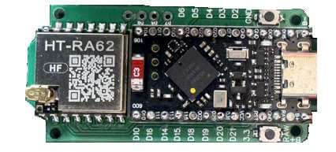
  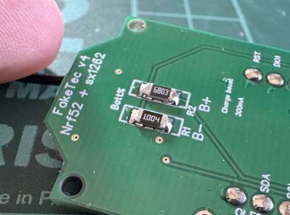
  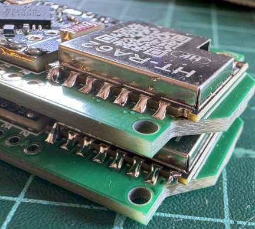

:::tip
Recuerda que toda la información y versiones del proyecto _Faketec_ están en GitHub: https://github.com/gargomoma/fakeTec_pcb
:::

---

## Diagrama de cableado

:::danger
Nunca enciendas el dispositivo sin conectar la antena. Hacer esto puede provocar que se queme el módulo de radio. Asegurate siempre de tener una antena conectada.
:::

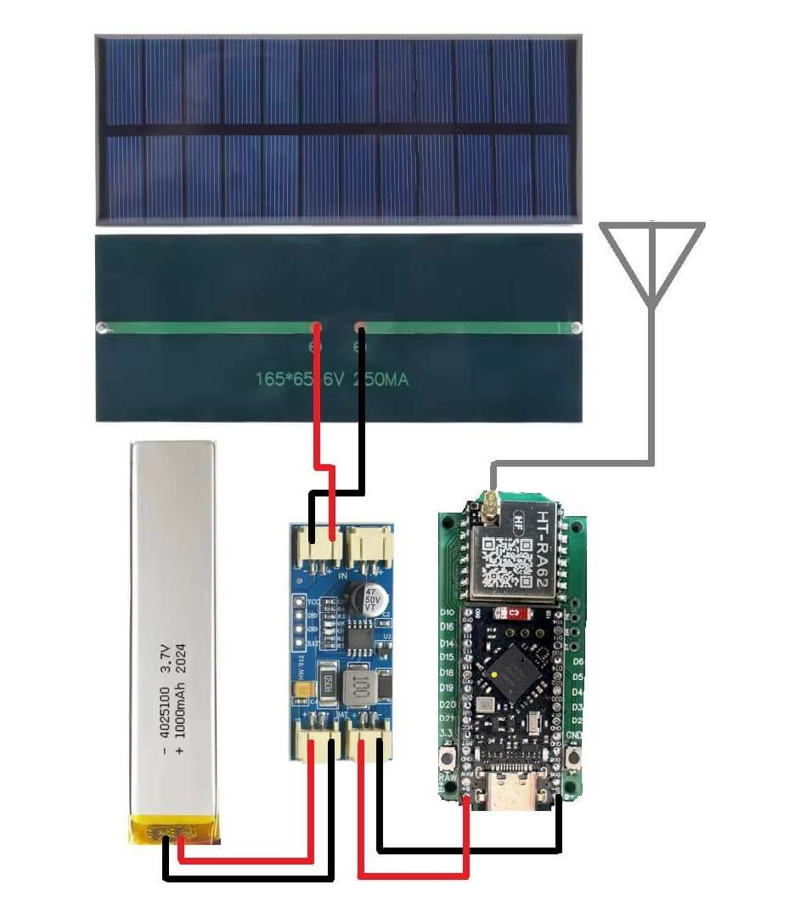

A mi me gusta usar la batería LiPo como base para sujetar la electrónica. La encinto con cinta Kapton y dado que
la batería tiene el mismo diámetro que el diámetro interior del tubo, el conjunto queda encajado perfectamente.

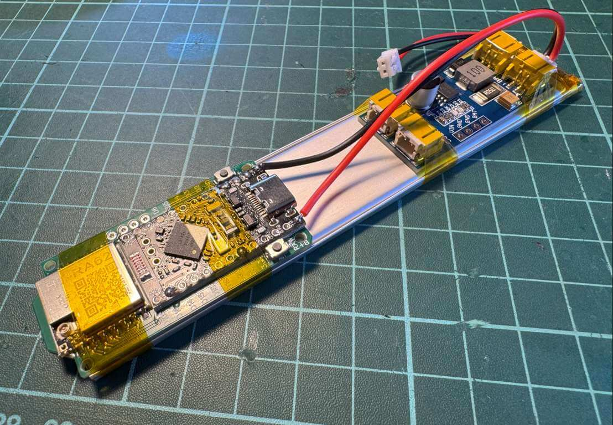

:::note
Por el momento vamos a dejar el cable del Faketec conectado al MPPT pero sin conectar la batería. La batería
será lo ultimo que conectemos antes de sellar el tubo.
:::

---

## Fabricación de la Antena (J-Pole casera)

Para minimizar el coste por nodo me fabrico la antena de manera casera. Y para poder maximizar el rendimiento
de la misma uso un NanoVNA de modo que pueda observar su comportamiento y poder ajustarla
adecuadamente. La frecuencia de resonancia de la antena debe de estar centrada sobre los 869.500 Mhz ya que
esta es la frecuencia sobre la que trabaja LoRa en la UE.

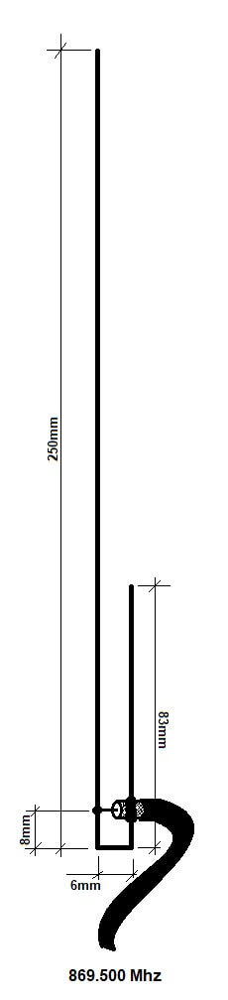
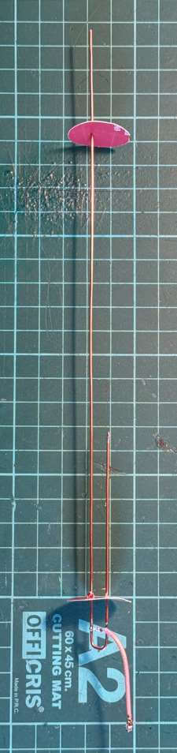
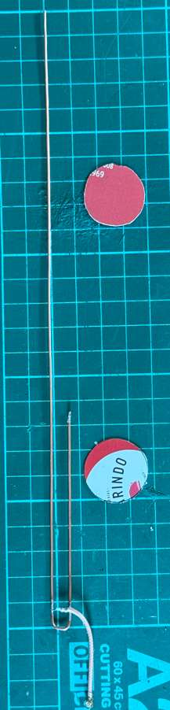

Cortamos un trozo de cobre de unos 40cm y lo estirarmos hasta que quede recto.
Cortamos los extremos que hemos usado para sujetarlo mientras estirábamos.
Desde un extremo, medimos 250mm, doblamos 90º, medimos 6mm y volvemos a doblar 90º.
Nos sobrará más de los 83 mm.
Soldamos el cable en transversal como se muestra en el diagrama de la derecha. No es necesario más de 4 o 5
cm de cable.

:::danger
¡Ojo! Es importante que el cable quede transversal. De hacerlo cruzando por el centro de la parte inferior se alterará la recepción.
:::

Si no tenemos NanoVNA, cortamos la sección de la derecha a 83mm. Si tenemos NanoVNA cortamos a 85mm.
Luego iremos recortando de aquí para afinar la antena.
Instalamos los dos discos de cartón de 24mm que servirán para mantener el dipolo centrado y que no toque el PVC ya que si toca el PVC se verá muy afectada la resonancia.

:::info
¡Muy importante! En caso de tener
NanoVNA las mediciones han de
hacerse con el resto de componentes
que afectan a la atena. Esto es, los discos de cartón instalados y la antena introducida en el tubo.
:::

Para afinar la antena conectaremos el NanoVNA e iremos recortando del trozo de cobre de la derecha por la
parte superior reduciendo los 85mm poco a poco.
El proceso es el siguiente: se monta dentro del tubo, se mide con NanoVNA, y si la frecuencia está por debajo, se saca antena, se corta un pelín (menos de 1mm a ser posible), se introduce nuevamente y se mide de nuevo. Repetir hasta que esté en 869.500Mhz.

Si nos pasamos cortando y la frecuencia queda por encima de lo deseado, ¡Don’t Panic! 😩 Podemos soldar un
trozo de cobre para alargarlo nuevamente (bajando así la frecuencia) y volver a repetir el proceso de prueba y
error.

A continuación comparto dos capturas del NanoVNA para ilustrar la diferencia y cuanto afecta al
funcionamiento de la antena. Ambas imágenes están midiendo exactamente la misma antena sin cambiarle
nada.
La diferencia es que la foto de la primera es con el tubo y la de la segunda es sin el tubo de PVC:

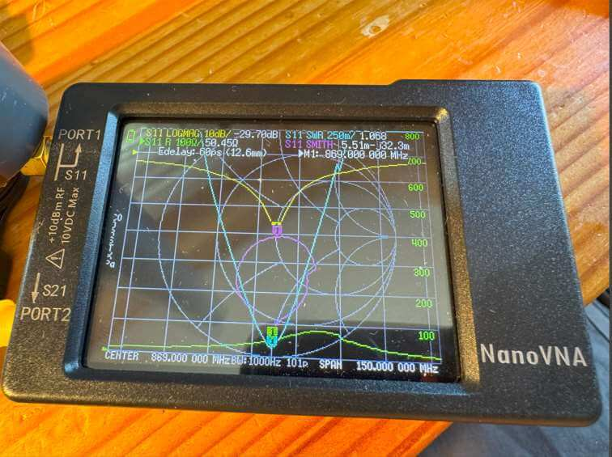
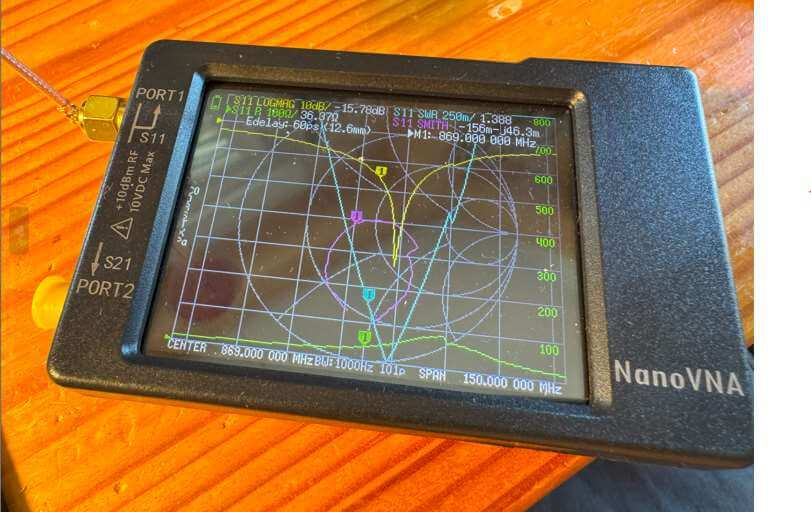

Como se puede observar, en la imagen de arriba, la frecuencia está centrada en 869 mientras en la de abajo, se ha subido sobre los 880Mhz.
Las medidas están calculadas con la siguiente calculadora para J-Pole:
https://m0ukd.com/calculators/slim-jim-and-j-pole-calculator/

Alternativamente se puede emplear en su lugar cualquier antena palo y un latiguillo SMA-U.FL.

**_Resumen:_**

- Cobre de 40 cm, doblado en L
- 250mm vertical, 6mm horizontal
- Parte derecha: cortar a 85mm y afinar con NanoVNA
- Añadir discos de cartón de 24mm para centrar
- Resonancia ideal: 869.500 MHz
- [Calculadora J-Pole](https://m0ukd.com/calculators/slim-jim-and-j-pole-calculator/)

---

## Montaje final

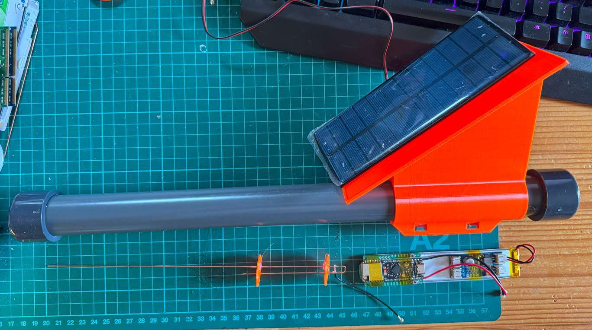

Empezamos con un trozo de tubo de unos 40cm. Realizamos un agujero a unos 4 cm de lo que será el extremo
inferior e introducimos el soporte impreso en 3D con el panel mirando hacia lo que será la parte superior y
alinearemos los agujeros del soporte y del tubo. Lo fijamos con silicona tanto en el anillo superior del soporte
como en el inferior.
Pasamos los cable del panel solar y cuando quede nada por pasar metemos silicona en el tubo de los cables
para evitar que se cuele agua por ahi. Ponemos también silicona en el borde del panel para sujetarlo firmemente
al soporte.
Desde el lado inferior comenzamos introduciendo la antena con cuidado del cable del panel solar. Cuando solo
nos quede el cable de la antena lo conectamos a la electrónica y aseguramos el conector con silicona o punto
de cola caliente o cinta Kapton para asegurarnos que no se desconecte accidentalmente mientras empujamos
todo el conjunto.
Recortamos y soldamos los cables del panel al conector para poder conectarlo al MPPT, o bien lo soldamos
directamente al MPPT, antes introducir electrónica. Cuando empujemos la electrónica lo haremos suavemente
ya que también estaremos empujando la antena por el interior del tubo.
Por último conectaremos la batería al MPPT y cerraremos ambos extremos con los tapones. Es conveniente
sellar el tapón inferior también con silicona.

Ahora ya podemos conectar por bluetooth y pasar a la **[Configuración inicial](../guias-basicas/puesta-en-marcha.md)**

**_Resumen:_**

1. Cortar tubo de 40 cm
2. Agujerear para pasar cable del panel
3. Pegar soporte 3D con silicona
4. Introducir antena y electrónica
5. Conectar cable solar al MPPT
6. Conectar batería
7. Sellar ambos extremos

---

## Configuración inicial

1. Descargar APP Meshtastic
2. Conectar por Bluetooth (clave: `123456`)
3. Configurar:
   - Región: `EU_868`
   - Radio preset: `MediumFast`
   - TX habilitado
4. Guardar y reiniciar
5. Configurar nombre del nodo

Más info: [https://meshtastic.es](https://meshtastic.es)

---

## Actualizaciones por Bluetooth (iOS)

:::info
Las imágenes están capturadas en iPhone pero también es posible realizar el proceso en Android.
:::

Se puede actualizar rompiendo el sello, sacando la electrónica y conectando un USB siguiendo lo comentado
en la página 8 de este manual, o se pueden realizar actualizaciones mediante Bluetooth sin necesidad de
desmontar la antena.
A continuación vamos a describir como hacerlo mediante Bluetooth (iOS).

- Necesitamos descargar desde la AppStore una aplicación llamada nRF Connect. Esta aplicación nos permitirá
  conectarnos al bluetooth de la Faketec, meterlo en modo DFU y lanzar la actualización a través del bluetooth.
- También necesitamos descargarnos la versión -ota.zip (Over The Air) correspondiente desde la página github de
  Meshtastic, sección Releases (https://github.com/meshtastic/firmware/releases), archivo con la versión que
  queramos poner (en este ejemplo 2.6.11, firmware-nrf52840-2.6.11.60ec05e.zip) y al descomprimirlo
  sacaremos el archivo para la faketec: firmware-nrf52_promicro_diy_tcxo-2.6.11.60ec05e-ota.zip y lo
  abriremos con la aplicación nRF Connect.
- En la aplicación nRF Connect, en la pantalla de Scanner buscamos nuestro Meshtastic (el mío se llama KST4).
  Para que aparezca en esta pantalla tenemos que estar desconectados del bluetooth de dicho nodo. Una vez
  localizado, le damos a Connect.
- Nos vamos a la última pestaña, seleccionamos el archivo (firmware-nrf52_promicro_diy_tcxo-
  2.6.11.60ec05e-ota.zip) con el que queremos actualizar y le damos a Start. Nos fallará, es normal y no pasa
  nada. Este paso habrá metido nuestro nodo en modo DFU. Al entrar en DFU cambia la MAC y el nombre del dispositivo
  Bluetooth.
- Volvemos a la pantalla de Scanner y buscamos un nuevo dispositivo llamado AdaDFU. Le damos a Connect
  nuevamente y volveremos a seleccionar el archivo de actualización en la última pestaña. ¡Muy Importante! Hay
  que cambiar el valor de configuración PRN(s) a 5. Le damos a Start y esperamos pacientemente.
- Observaremos como una barra de progreso se va cargando poco a poco.
- El teléfono puede bloquearse y fastidiar la carga del firmware. Es importante desactivar bloqueo automático o ir
  tocándolo de tanto en tanto para evitar que se bloquee.
- Cuando haya terminado de actualizarse, el nodo se reiniciará automáticamente con la nueva versión de
  firmware.

:::danger
Si algo falla a mitad del proceso el nodo se quedara en modo DFU y requerirá acceder a él físicamente para realizar un reset.
:::

:::tip
Recomendamos probar primero en una unidad de prueba para aprender a realizar el proceso antes de hacerlo con un nodo poco accesible.
:::

### Capturas de pantalla

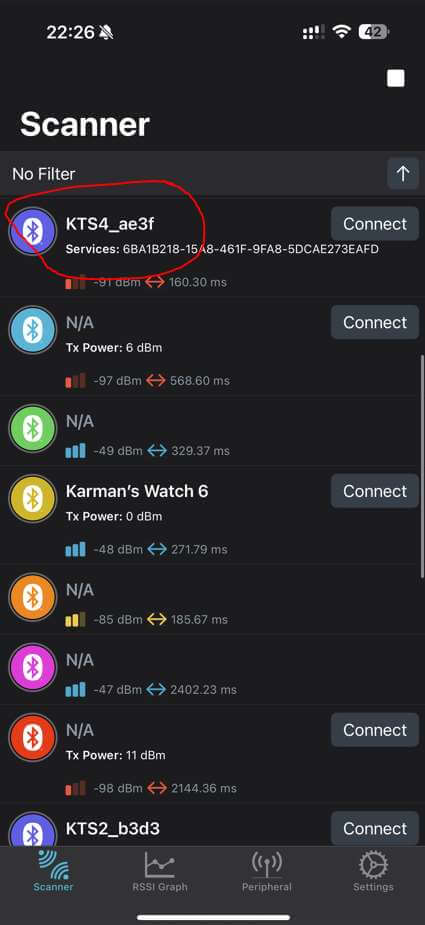
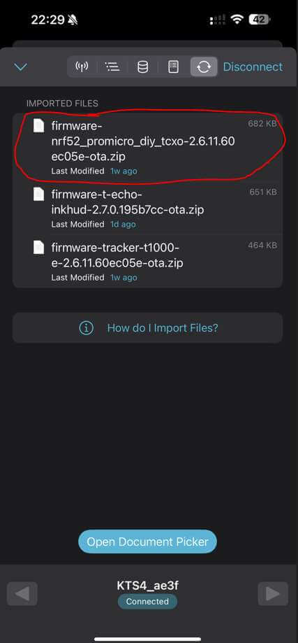
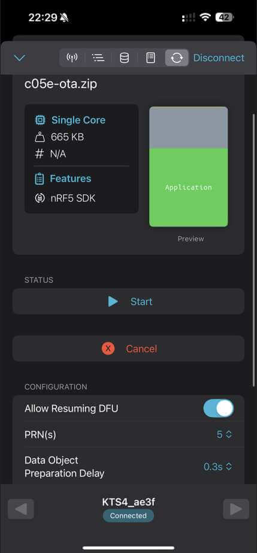
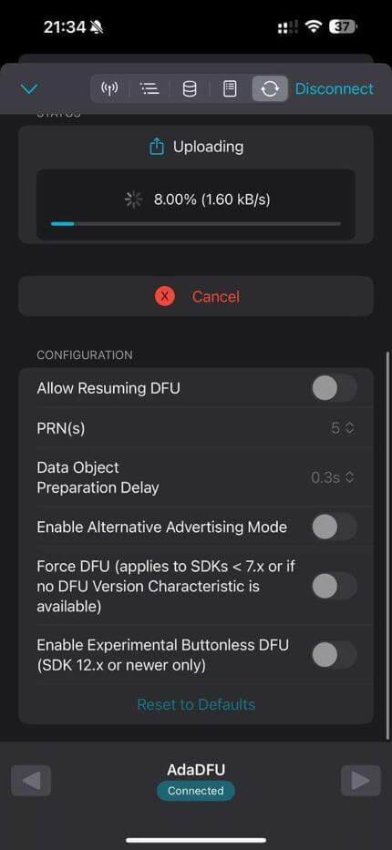

**_Resumen_**

1. Descargar APP `nRF Connect`
2. Descargar firmware OTA desde
   [Releases Meshtastic](https://github.com/meshtastic/firmware/releases)
3. En `nRF Connect`:
   - Conectar al nodo
   - Intentar actualizar (fallará = entra en DFU)
   - Conectar a `AdaDFU`
   - Cargar firmware (`*.ota.zip`)
   - Cambiar `PRN(s)` a `5`
4. Esperar finalización y reinicio automático

---

Preparado y redactado por:

**Carlos Sancho, Karman**
[http://karman.cc](http://karman.cc)

Adaptación a web por: [emylio](https://telegram.me/sremylio)

:::info
Esta documentación fue creada por [Karman](http://karman.cc) y está licenciada bajo [CC BY-SA 4.0.](https://creativecommons.org/licenses/by-sa/4.0/deed.es)
:::
