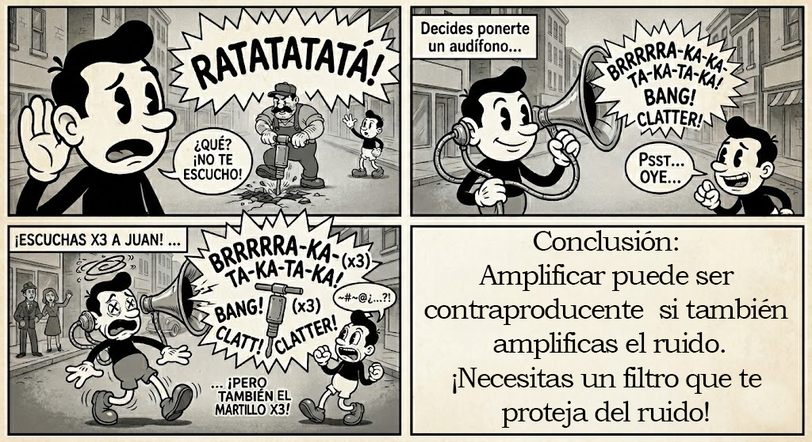

# Preguntas frecuentes

<!-- El icono no existe, así que he cogido el de la llave y le he puesto un rectángulo, rotado unos 45º, a modo de tachado. -->
export const KeyOffIcon = () => (
<svg xmlns="http://www.w3.org/2000/svg" width="24" height="24" viewBox="0 0 24 24" width="1em" height="1em" class="iconify">
<path fill="currentColor" d="M7 14c-1.1 0-2-.9-2-2s.9-2 2-2s2 .9 2 2s-.9 2-2 2m5.6-4c-.8-2.3-3-4-5.6-4c-3.3 0-6 2.7-6 6s2.7 6 6 6c2.6 0 4.8-1.7 5.6-4H16v4h4v-4h3v-4z"/>
<rect x="22" y="-5" transform="matrix(.707 -.707 .707 .707 -9.941 24)" fill="currentColor" width="3" height="24"/>
</svg>
);

## Enviar mensajes por MQTT en el canal principal o Iberia {#mqtt-downlink}

En el servidor MQTT hemos deshabilitado el _downlink_ a los canales con nombre de _presets_ (LongFast, MediumFast...)
e Iberia. Esto se hizo para evitar que los nodos se saturen con paquetes de toda España y probablemente consuman el
[_duty cycle_](#duty-cycle).

Sin embargo, <u>es **importante** mantener activado</u> en los nodos tanto _uplink_ como _downlink_ en estos canales, ya
que nos da más agilidad en el futuro si cambiamos algo en el servidor MQTT. Además, se permite que lleguen mensajes
directos, telemetrías y otros paquetes cifrados, como por ejemplo la [administración de nodos en remoto](configuracion-avanzada/administracion-remota.md).

La gran mayoría de los nodos en España tienen como canal principal el canal del _preset_ (LongFast, MediumFast...). Al ser
canal principal, es por donde se envían todos los paquetes de NodeInfo, telemetría variada, ubicación... todos esos datos
que se mandan a intervalos. Si tu nodo reenviara por radiofrecuencia todo eso, llegaría rápidamente a su [_duty cycle_](#duty-cycle).

## Problemas comunes {#problemas-comunes}

### Mi nodo no aparece en los mapas de la web {#nodo-no-aparece-en-mapas}

Échale un vistazo a [cómo hacer que el nodo aparezca en los mapas](mapas.md#como-aparecer-en-mapas).
Si aun así no aparece, pregunta en [Telegram](https://t.me/meshtastic_esp) para que podamos ayudarte.

### He activado el WiFi en mi nodo y ahora no puedo conectar por Bluetooth :mdi-wifi: :mdi-bluetooth: {#wifi-o-bluetooth}

La mayoría de los nodos Meshtastic tienen una única antena para el WiFi y el Bluetooth. Por lo tanto, si uno está
activado, el otro no podrá funcionar. En este caso, el WiFi tiene prioridad.

Para volver a conectar por Bluetooth, conéctate al nodo a través del WiFi mediante su IP local,
entra en :mdi-settings: _Radio configuration_ › :mdi-wifi: _Network_ y desactiva el _WiFi enabled_. Cuando se reinicie
el nodo, podrás volver a conectarte por Bluetooth.

### Me sale un aviso de claves comprometidas y hay que regenerarlas {#claves-comprometidas}

También conocido como _Compromised keys detected, select OK to regenerate_. Este mensaje indica que las claves
pertenecen a un grupo de claves privadas conocidas que también pueden existir en otros nodos, debido a cómo se generaron
en algunos _firmwares_ (baja entropía). Tienes más información en la
[_release_ 2.6.11](https://github.com/meshtastic/firmware/releases/tag/v2.6.11.60ec05e).

Para solucionarlo, debes generar una nueva clave privada. Tienes varias formas de hacerlo:
- Entrando en :mdi-settings: _Radio configuration_ › :mdi-shield-half-full: _Security_ y pulsando en
:mdi-warning-outline: _Regenerate Private Key_.
- Flasheando de nuevo el firmware, marcando la opción de _Full Erase and Install_.

:::warning

Cuando regeneres las claves, **perderás el acceso remoto** (mediante _Remote administration_) ya que la clave pública
cambia. Haz una copia de tus claves, por si tuvieras que volver a utilizarlas.

:::

### ¿Por qué aparece un candado amarillo en un canal? :mdi-unlocked-variant-outline: {#candado-amarillo-canal}

El candado amarillo indica que el canal está utilizando la clave por defecto. Es normal en los canales públicos (MediumFast,
LongFast, Iberia, canales de provincia...). No se considera tan segura porque es pública y conocida por todo el mundo.

En canales privados, cambia la clave del canal por una propia para cifrar tus comunicaciones.

### ¿Por qué aparece un triángulo rojo en un canal? :mdi-warning: {#warning-rojo-canal}

El triángulo rojo indica que estás compartiendo tu ubicación precisa en un canal cuya clave se considera de poca seguridad. Esto se
puede traducir en un problema de privacidad ya que estás compartiendo tu ubicación exacta con cualquiera en ese canal.

Entra en la configuración del canal, desactiva la ubicación precisa y configura un cierto margen de error.

### ¿Qué significa la llave roja tachada en un nodo? <KeyOffIcon /> {#llave-roja-nodo}

La llave roja nos indica que la clave pública recibida del nodo no coincide con la que teníamos registrada anteriormente.
Los nodos tienen una clave pública y privada que se utiliza para cifrar la comunicación directa entre nodos (más info en
la [documentación oficial](https://meshtastic.org/docs/overview/encryption/).

Para registrar la nueva clave pública, borra el nodo y deja que se vuelva a descubrir. También puedes pedir al dueño del
nodo que te comparta la URL o el QR de ese nodo.

### ¡Mi nodo con LNA está sordo! ¡Escucha peor que otros nodos!

Tienes un Heltec v4, un Ebyte e22... ¿y escucha peor que otros nodos?

**Es normal, ¡estás ampliando el ruido!**

:::info
Recomendamos:
    - **NO USAR** nodos con LNA sin filtro.
    - Filtros: Taoglass DBP868UA30 o filtros de cavidades.
    - Usar radios con filtros incorporados. (Ebyte E22-P)
:::

**¿Quieres entender las razones? Sigue leyendo.**

Imagínate que estás en la calle, al lado de una obra y están con el martillo neumático.
Tu amigo Juan está a unos metros y te quiere contar algo....

- ruido de fondo: ¡RATATATATÁ!
- Juan: Psst... oye...
- Tú: ¿Qué? ¡No te escucho! *[Decides ponerte un audífono]*
- Ahora escuchas x3 a Juan... ¡pero también escuchas x3 el martillo neumático! *[El ruido es tan fuerte que hasta te da mareos.]*

No sólo sigues sin escuchar *bien*, ¡sino que ha emperado la situación!

Conclusión: Amplificar sin filtro puede ser contraproducente si también amplificas el ruido. Sin filtro, los nodos *están sordos*.

:::tip
**RSSI** es qué tan fuerte llega la voz de Juan a tus oídos.

**SNR** es la diferencia entre la voz de Juan y el martillo:

— Si el martillo suena MUCHO MÁS FUERTE que Juan: SNR Negativo.

    — Si Juan hablase MÁS FUERTE que el martillo: SNR Positivo.
:::

## Definiciones y nomenclatura

### Qué es el _channel utilization_ o _ChUtil_{#chutil}

El _channel utilization_ o _ChUtil_ es el porcentaje de tiempo que el canal de radio está ocupado transmitiendo paquetes.
Esto incluye tanto los paquetes que transmites tú como los que transmiten otros nodos. Es importante porque si el canal está
muy ocupado, es posible que tus paquetes no se transmitan, se retrasen, o haya colisiones.

### Qué es el _airtime utilization_ o _AirUtil_{#airutil}

El _airtime utilization_ o _AirUtil_ es el porcentaje de tiempo que tu nodo está transmitiendo paquetes. Es importante
mantenerlo bajo para no saturar el canal de radio y para no consumir tu [_duty cycle_](#duty-cycle).

### Qué es el _duty cycle_ y por qué es importante {#duty-cycle}

El _duty cycle_ es el porcentaje de tiempo que un dispositivo puede transmitir en un canal de radio. Es importante porque
está regulado por normativa. En España, el _duty cycle_ máximo permitido es del **10% por hora** en las bandas europeas
de 433 MHZ y 868 MHz. Si un nodo supera ese límite, el _firmware_ lo detectará y dejará de transmitir paquetes hasta que
pase esa hora.

Más información en la [documentación oficial](https://meshtastic.org/docs/configuration/radio/lora/#region).
